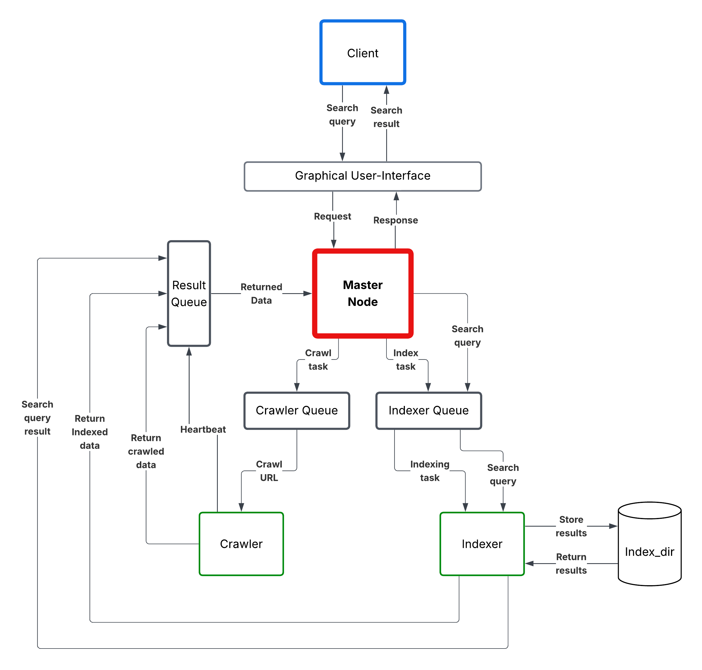

# Distributed-Web-Crawler
## 📌 Overview
A fault-tolerant distributed system that:
1. **Crawls** websites using multiple worker nodes  
2. **Indexes** extracted content for fast searching  
3. **Searches** crawled data through a web interface  

## 🏗️ Architecture Diagram


The **Master Node** coordinates everything: it receives requests from the GUI, dispatches crawl tasks to the **Crawler Queue** and index tasks to the **Indexer Queue**, and routes search queries to the **Indexer**. **Crawler** and **Indexer** worker nodes pull tasks from their respective queues, send heartbeats, and push results back through the **Result Queue** to the Master Node. The Indexer persists and retrieves data from **Index_dir**.

## ⚙️ Core Technologies
- **HTTP Requests**: Requests library
- **HTML Parsing**: BeautifulSoup
- **Indexing**: Whoosh
- **Web Framework**: Flask
- **Distributed Queue**: AWS SQS
- **Cloud VMS**: AWS EC2

## 🛠️ Environment Setup
Before running the system, ensure the following requirements are installed:
- Python 3.7 or higher.
- All required Python libraries specified in requirements.txt.

To install the necessary libraries, run the following command:
```bash
pip install -r requirements.txt
```

## ☁️ AWS Cloud Setup:
1. Create an IAM user with SQS access permissions
2. Edit `utils.py` and replace these values:
```python
AWS_ACCESS_KEY = 'YOUR_ACCESS_KEY_HERE'  # IAM access key
AWS_SECRET_KEY = 'YOUR_SECRET_KEY_HERE'  # IAM secret key
AWS_REGION = 'us-east-1'  # Change to your preferred region
```

## 🚀 Running the System Components
Each component must be run in a separate terminal window.

### 1. Master Node
Coordinates crawling tasks and handles search requests.
```bash
python master_node.py
```

### 2. Crawler Nodes
Fetch URLs and extract data. Run multiple instances with unique IDs:
```bash
python crawler_node.py <crawler_id>
```
(Replace "1" with 2, 3, etc. for additional crawlers)

### 3. Indexer Node
Processes crawled data into searchable index:
```bash
python indexer_node.py
```

### 4. Client Interface
Web interface for searching indexed content:
```bash
python client.py
```
Access at: 
```bash
http://localhost:5002 
```
or if you are using a cloud environment:
```bash
http://<server-ip>:5002
```

### 5. Clearing Queues
Reset all queues before new sessions:
```bash
python clear_queues.py
```

## ⚠️ Important Notes
- Configure your own AWS credentials properly
- Ensure network connectivity between components
- Verify SQS queues exist and are configured
- Use separate terminals/machines for distributed testing
